# ARCANE: The On-Chain Spellcraft Arena


**ARCANE** is a fully on-chain multiplayer battle arena where every player state, spell, and combat interaction is verified and executed on Starknet using the Dojo ECS framework. This project represents a paradigm shift in blockchain gaming by moving game logic itself onto the blockchain, not just assets.

**Repository:** [Chains-Of-Eternity-Starknet](https://github.com/Vinayak-RZ/Chains-Of-Eternity-Starknet/blob/main)

---

## Table of Contents

- [Overview](#overview)
- [Architecture](#architecture)
- [System Design](#system-design)
- [Smart Contract Structure](#smart-contract-structure)
- [Unity Integration](#unity-integration)
- [Installation & Setup](#installation--setup)
- [Gameplay Mechanics](#gameplay-mechanics)
- [Technical Stack](#technical-stack)
- [Development Workflow](#development-workflow)
- [Deployment](#deployment)
- [Contributing](#contributing)
- [License](#license)

---

## Overview

### What Makes ARCANE Different?

Traditional blockchain games store only assets (NFTs, tokens) on-chain while keeping core gameplay off-chain. ARCANE inverts this model by implementing the entire game simulation layer on Starknet using Cairo smart contracts and the Dojo Entity Component System (ECS) framework.

### Core Features

**On-Chain Game State Machine**
- Player Finite State Machine (FSM) with states: Idle, Running, Dashing, Attacking, Dead
- All state transitions verified and stored on-chain
- Real-time state synchronization between Unity client and blockchain

**Composable Spell System**
- Players create custom spells with 17+ parameters
- Spells stored as on-chain components, reusable by any player
- True ownership and composability of game mechanics

**PvP Combat System**
- Deterministic combat resolution executed in Cairo
- Damage calculations, knockback, and health updates all on-chain
- Verifiable fairness through blockchain consensus

**Enemy AI & PvE**
- Enemy entities (Witch, Boss types) managed on-chain
- Health tracking, damage application, and death events
- Supports future AI-driven behaviors through on-chain systems

**Multiplayer Sessions**
- Game sessions created and tracked on-chain
- Player-to-player matchmaking with session IDs
- Persistent combat history and statistics

---

## Blockchain Architecture

### Game-Blockchain Integration Overview

ARCANE implements a hybrid architecture where critical game logic executes on-chain while rendering and real-time interactions happen client-side. This section details how every blockchain component functions.

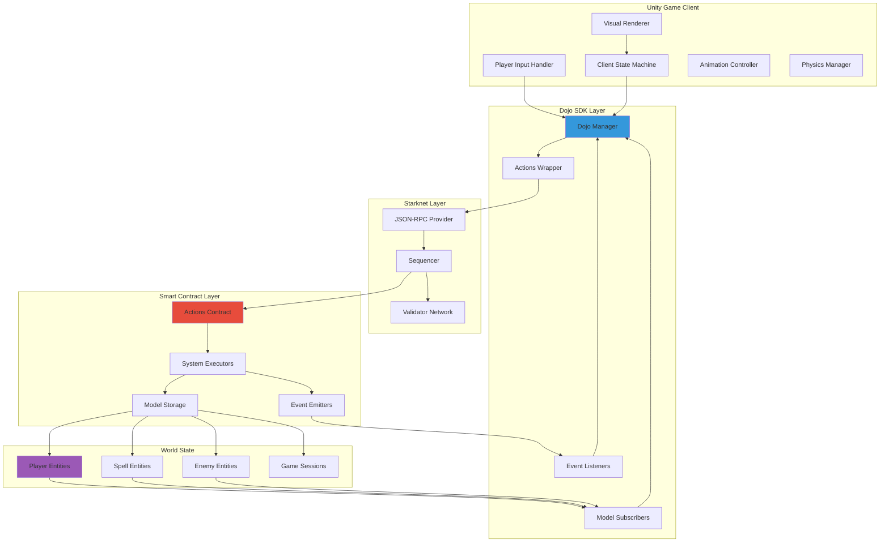
```mermaid
graph TB
    subgraph "Unity Game Client"
        UC[Player Input Handler]
        UR[Visual Renderer]
        USM[Client State Machine]
        UA[Animation Controller]
        UPM[Physics Manager]
    end
    
    subgraph "Dojo SDK Layer"
        DS[Dojo Manager]
        DA[Actions Wrapper]
        DM[Model Subscribers]
        DE[Event Listeners]
    end
    
    subgraph "Starknet Layer"
        SR[JSON-RPC Provider]
        SS[Sequencer]
        SV[Validator Network]
    end
    
    subgraph "Smart Contract Layer"
        SC[Actions Contract]
        SM[Model Storage]
        SE[System Executors]
        SEV[Event Emitters]
    end
    
    subgraph "World State"
        WP[Player Entities]
        WS[Spell Entities]
        WE[Enemy Entities]
        WG[Game Sessions]
    end
    
    UC --> DS
    UR --> USM
    USM --> DS
    
    DS --> DA
    DA --> SR
    DM --> DS
    DE --> DS
    
    SR --> SS
    SS --> SC
    SS --> SV
    
    SC --> SE
    SE --> SM
    SE --> SEV
    
    SM --> WP
    SM --> WS
    SM --> WE
    SM --> WG
    
    SEV --> DE
    WP --> DM
    WS --> DM
    WE --> DM
    
    style SC fill:#E74C3C
    style WP fill:#9B59B6
    style DS fill:#3498DB
```

### Blockchain Transaction Flow

Every player action in ARCANE follows a specific transaction lifecycle:

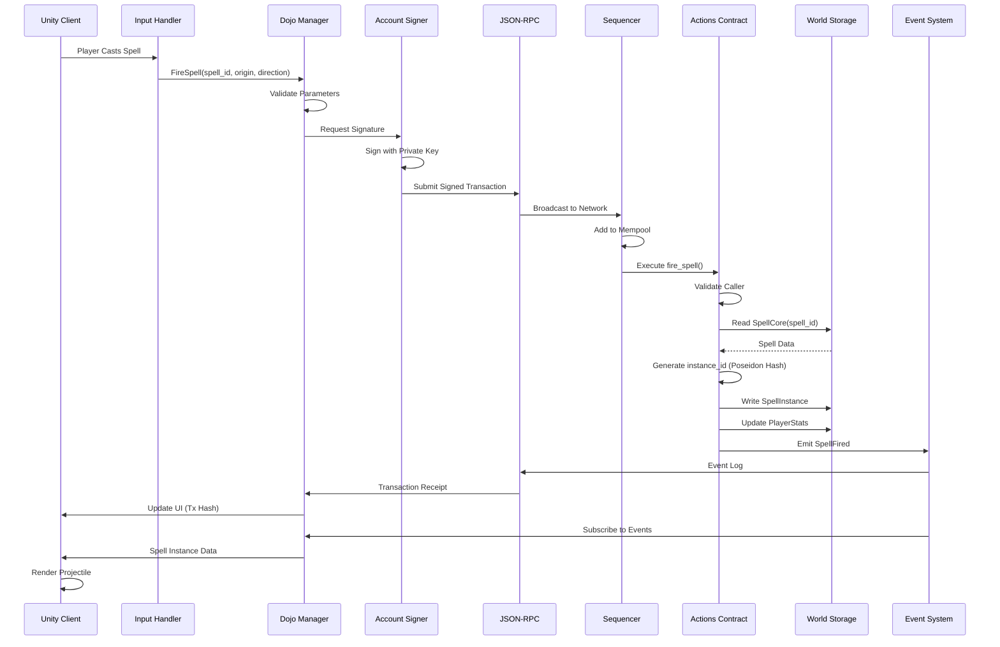
```mermaid
sequenceDiagram
    participant Unity as Unity Client
    participant Input as Input Handler
    participant Dojo as Dojo Manager
    participant Wallet as Account Signer
    participant RPC as JSON-RPC
    participant Seq as Sequencer
    participant Contract as Actions Contract
    participant Storage as World Storage
    participant Events as Event System
    
    Unity->>Input: Player Casts Spell
    Input->>Dojo: FireSpell(spell_id, origin, direction)
    Dojo->>Dojo: Validate Parameters
    Dojo->>Wallet: Request Signature
    Wallet->>Wallet: Sign with Private Key
    Wallet->>RPC: Submit Signed Transaction
    RPC->>Seq: Broadcast to Network
    Seq->>Seq: Add to Mempool
    Seq->>Contract: Execute fire_spell()
    Contract->>Contract: Validate Caller
    Contract->>Storage: Read SpellCore(spell_id)
    Storage-->>Contract: Spell Data
    Contract->>Contract: Generate instance_id (Poseidon Hash)
    Contract->>Storage: Write SpellInstance
    Contract->>Storage: Update PlayerStats
    Contract->>Events: Emit SpellFired
    Events->>RPC: Event Log
    RPC->>Dojo: Transaction Receipt
    Dojo->>Unity: Update UI (Tx Hash)
    Events->>Dojo: Subscribe to Events
    Dojo->>Unity: Spell Instance Data
    Unity->>Unity: Render Projectile
```

### On-Chain State Management

#### World State Structure

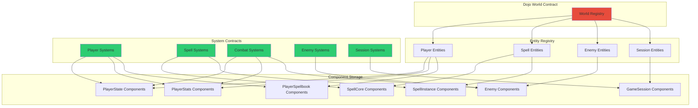
```mermaid
graph TB
    subgraph "Dojo World Contract"
        W[World Registry]
    end
    
    subgraph "Entity Registry"
        E1[Player Entities]
        E2[Spell Entities]
        E3[Enemy Entities]
        E4[Session Entities]
    end
    
    subgraph "Component Storage"
        C1[PlayerState Components]
        C2[PlayerStats Components]
        C3[PlayerSpellbook Components]
        C4[SpellCore Components]
        C5[SpellInstance Components]
        C6[Enemy Components]
        C7[GameSession Components]
    end
    
    subgraph "System Contracts"
        S1[Player Systems]
        S2[Spell Systems]
        S3[Combat Systems]
        S4[Enemy Systems]
        S5[Session Systems]
    end
    
    W --> E1
    W --> E2
    W --> E3
    W --> E4
    
    E1 --> C1
    E1 --> C2
    E1 --> C3
    
    E2 --> C4
    E2 --> C5
    
    E3 --> C6
    
    E4 --> C7
    
    S1 --> C1
    S1 --> C2
    S1 --> C3
    
    S2 --> C4
    S2 --> C5
    
    S3 --> C1
    S3 --> C2
    S3 --> C6
    
    S4 --> C6
    
    S5 --> C7
    
    style W fill:#E74C3C
    style S1 fill:#2ECC71
    style S2 fill:#2ECC71
    style S3 fill:#2ECC71
    style S4 fill:#2ECC71
    style S5 fill:#2ECC71
```

#### Component Lifecycle

Every entity in ARCANE follows a strict lifecycle managed by Cairo contracts:

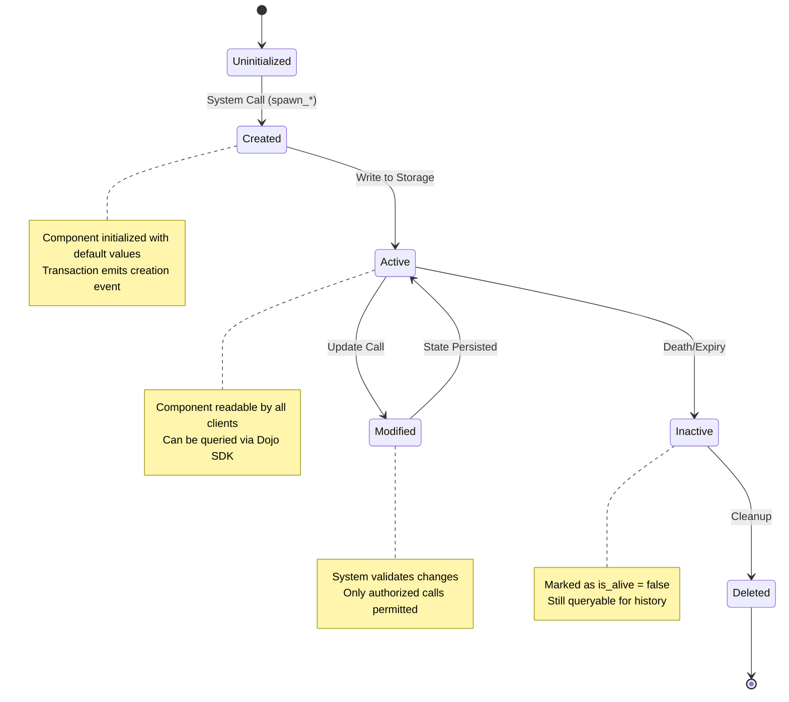
```mermaid
stateDiagram-v2
    [*] --> Uninitialized
    Uninitialized --> Created: System Call (spawn_*)
    Created --> Active: Write to Storage
    Active --> Modified: Update Call
    Modified --> Active: State Persisted
    Active --> Inactive: Death/Expiry
    Inactive --> Deleted: Cleanup
    Deleted --> [*]
    
    note right of Created
        Component initialized with default values
        Transaction emits creation event
    end note
    
    note right of Active
        Component readable by all clients
        Can be queried via Dojo SDK
    end note
    
    note right of Modified
        System validates changes
        Only authorized calls permitted
    end note
    
    note right of Inactive
        Marked as is_alive = false
        Still queryable for history
    end note
```

---


## Architecture

### High-Level System Architecture

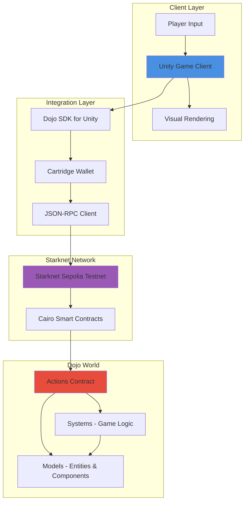
```mermaid
graph TB
    subgraph "Client Layer"
        A[Unity Game Client]
        B[Player Input]
        C[Visual Rendering]
    end
    
    subgraph "Integration Layer"
        D[Dojo SDK for Unity]
        E[Cartridge Wallet]
        F[JSON-RPC Client]
    end
    
    subgraph "Starknet Network"
        G[Starknet Sepolia Testnet]
        H[Cairo Smart Contracts]
    end
    
    subgraph "Dojo World"
        I[Actions Contract]
        J[Models - Entities & Components]
        K[Systems - Game Logic]
    end
    
    B --> A
    A --> C
    A --> D
    D --> E
    E --> F
    F --> G
    G --> H
    H --> I
    I --> J
    I --> K
    K --> J
    
    style A fill:#4A90E2
    style G fill:#9B59B6
    style I fill:#E74C3C
```

### Entity Component System (ECS) Architecture

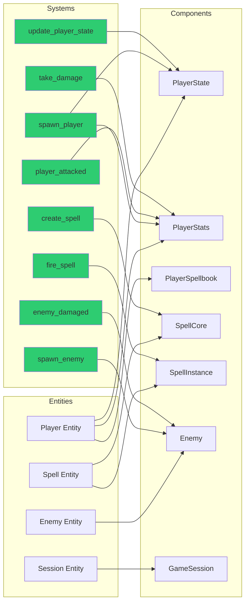
```mermaid
graph LR
    subgraph "Entities"
        E1[Player Entity]
        E2[Spell Entity]
        E3[Enemy Entity]
        E4[Session Entity]
    end
    
    subgraph "Components"
        C1[PlayerState]
        C2[PlayerStats]
        C3[PlayerSpellbook]
        C4[SpellCore]
        C5[SpellInstance]
        C6[Enemy]
        C7[GameSession]
    end
    
    subgraph "Systems"
        S1[spawn_player]
        S2[update_player_state]
        S3[create_spell]
        S4[fire_spell]
        S5[player_attacked]
        S6[take_damage]
        S7[spawn_enemy]
        S8[enemy_damaged]
    end
    
    E1 --> C1
    E1 --> C2
    E1 --> C3
    E2 --> C4
    E2 --> C5
    E3 --> C6
    E4 --> C7
    
    S1 --> C1
    S1 --> C2
    S2 --> C1
    S3 --> C4
    S4 --> C5
    S5 --> C2
    S6 --> C2
    S7 --> C6
    S8 --> C6
    
    style S1 fill:#2ECC71
    style S2 fill:#2ECC71
    style S3 fill:#2ECC71
    style S4 fill:#2ECC71
    style S5 fill:#2ECC71
    style S6 fill:#2ECC71
    style S7 fill:#2ECC71
    style S8 fill:#2ECC71
```

### Data Flow Architecture

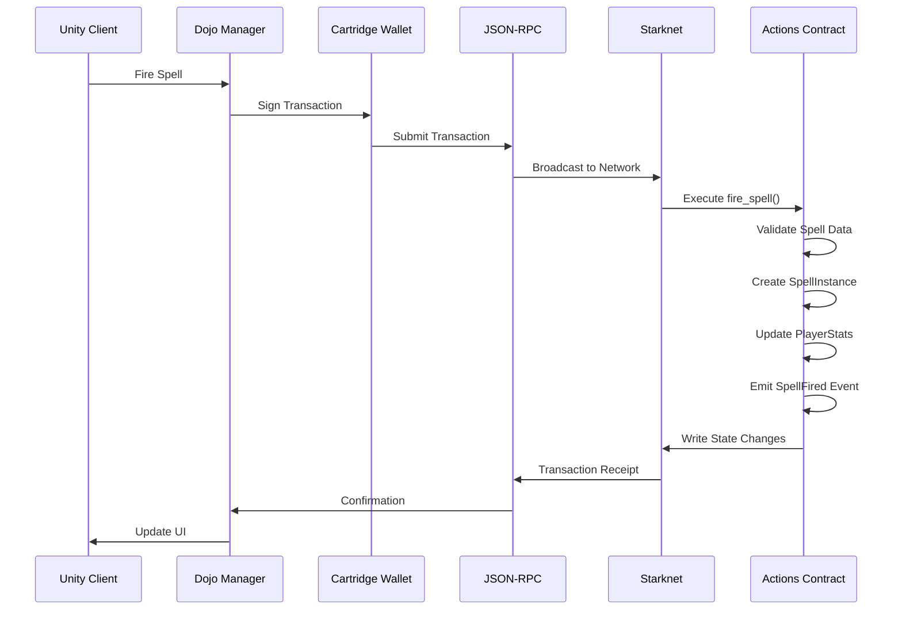
```mermaid
sequenceDiagram
    participant Player as Unity Client
    participant Dojo as Dojo Manager
    participant Wallet as Cartridge Wallet
    participant RPC as JSON-RPC
    participant Chain as Starknet
    participant Contract as Actions Contract
    
    Player->>Dojo: Fire Spell
    Dojo->>Wallet: Sign Transaction
    Wallet->>RPC: Submit Transaction
    RPC->>Chain: Broadcast to Network
    Chain->>Contract: Execute fire_spell()
    Contract->>Contract: Validate Spell Data
    Contract->>Contract: Create SpellInstance
    Contract->>Contract: Update PlayerStats
    Contract->>Contract: Emit SpellFired Event
    Contract->>Chain: Write State Changes
    Chain->>RPC: Transaction Receipt
    RPC->>Dojo: Confirmation
    Dojo->>Player: Update UI
```

---

## System Design

### Component Distribution

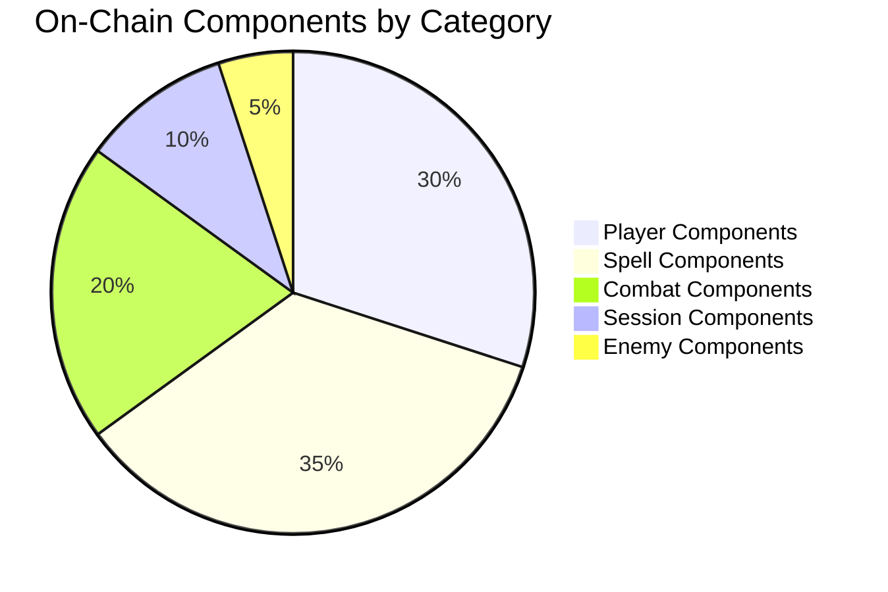
```mermaid
pie title On-Chain Components by Category
    "Player Components" : 30
    "Spell Components" : 35
    "Combat Components" : 20
    "Session Components" : 10
    "Enemy Components" : 5
```

### System Interaction Matrix

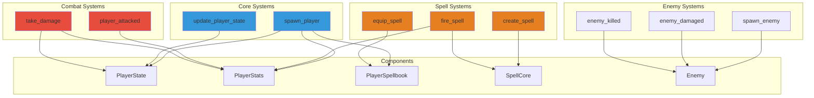
```mermaid
graph TB
    subgraph "Core Systems"
        spawn[spawn_player]
        update[update_player_state]
    end
    
    subgraph "Spell Systems"
        create[create_spell]
        fire[fire_spell]
        equip[equip_spell]
    end
    
    subgraph "Combat Systems"
        attack[player_attacked]
        damage[take_damage]
    end
    
    subgraph "Enemy Systems"
        enemySpawn[spawn_enemy]
        enemyDmg[enemy_damaged]
        enemyKill[enemy_killed]
    end
    
    subgraph "Components"
        state[PlayerState]
        stats[PlayerStats]
        book[PlayerSpellbook]
        spellCore[SpellCore]
        enemy[Enemy]
    end
    
    spawn --> state
    spawn --> stats
    spawn --> book
    
    update --> state
    
    create --> spellCore
    fire --> spellCore
    fire --> stats
    equip --> book
    
    attack --> stats
    damage --> stats
    damage --> state
    
    enemySpawn --> enemy
    enemyDmg --> enemy
    enemyKill --> enemy
    
    style spawn fill:#3498DB
    style update fill:#3498DB
    style create fill:#E67E22
    style fire fill:#E67E22
    style equip fill:#E67E22
    style attack fill:#E74C3C
    style damage fill:#E74C3C
```

### State Machine Flow

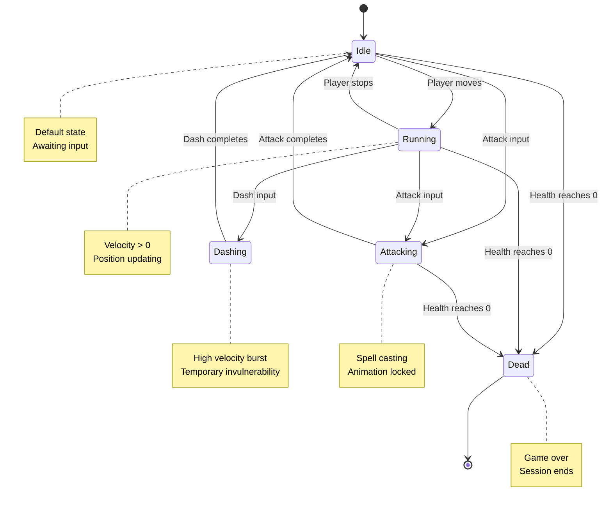
```mermaid
stateDiagram-v2
    [*] --> Idle
    Idle --> Running: Player moves
    Running --> Idle: Player stops
    Running --> Dashing: Dash input
    Dashing --> Idle: Dash completes
    Idle --> Attacking: Attack input
    Running --> Attacking: Attack input
    Attacking --> Idle: Attack completes
    Idle --> Dead: Health reaches 0
    Running --> Dead: Health reaches 0
    Attacking --> Dead: Health reaches 0
    Dead --> [*]
    
    note right of Idle
        Default state
        Awaiting input
    end note
    
    note right of Running
        Velocity > 0
        Position updating
    end note
    
    note right of Dashing
        High velocity burst
        Temporary invulnerability
    end note
    
    note right of Attacking
        Spell casting
        Animation locked
    end note
    
    note right of Dead
        Game over
        Session ends
    end note
```

---

## Smart Contract Structure

### Models (Components)

#### PlayerState
```cairo
pub struct PlayerState {
    pub player: ContractAddress,        // Unique player identifier
    pub state: PlayerFSMState,          // Current FSM state
    pub facing_dir: i16,                // Direction in degrees * 100
    pub position: Vec2i,                // X, Y coordinates
    pub velocity: i16,                  // Movement speed
    pub last_updated: u64,              // Timestamp of last update
    pub is_alive: bool,                 // Living status
}
```

**State Enum:**
- `Idle` (0): Player is stationary
- `Running` (1): Player is moving
- `Dashing` (2): Player is performing dash
- `Attacking` (3): Player is casting spell
- `Dead` (4): Player has been defeated

#### PlayerStats
```cairo
pub struct PlayerStats {
    pub player: ContractAddress,
    pub health: u16,                    // Current HP
    pub max_health: u16,                // Maximum HP
    pub mana: u16,                      // Current mana
    pub max_mana: u16,                  // Maximum mana
    pub spell_damage_dealt: u32,        // Total damage output
    pub spells_fired: u32,              // Total spells cast
}
```

#### SpellCore
```cairo
pub struct SpellCore {
    pub spell_id: felt252,              // Unique spell identifier
    pub creator: ContractAddress,       // Spell creator address
    pub element: SpellElement,          // Fire/Water/Lightning/Wind
    pub attack_subtype: AttackSubtype,  // Projectile/AoE
    pub damage: u16,                    // Base damage value
    pub knockback: u16,                 // Knockback force
    pub projectile_speed: u16,          // Travel velocity
    pub projectile_size: u16,           // Hitbox radius
    pub number_of_projectiles: u8,      // Multi-projectile count
    pub staggered_angle: i16,           // Spread angle
    pub zigzag_amplitude: u16,          // Zigzag pattern strength
    pub zigzag_frequency: u16,          // Zigzag oscillation rate
    pub homing_radius: u16,             // Target tracking range
    pub arc_gravity: u16,               // Projectile drop
    pub random_offset: u16,             // Randomized deviation
    pub circular_speed: u16,            // Orbital velocity
    pub circular_radius: u16,           // Orbit radius
    pub mana_cost: u16,                 // Mana consumption
    pub cooldown: u16,                  // Recast timer (ms)
}
```

**Spell Elements:**
- `Fire` (0): High damage, burn effects
- `Water` (1): Healing, crowd control
- `Lightning` (2): Fast projectiles, chain damage
- `Wind` (3): Knockback, area denial

#### Enemy
```cairo
pub struct Enemy {
    pub enemy_id: felt252,              // Unique enemy identifier
    pub enemy_type: EnemyType,          // Witch/Boss
    pub posx: i32,                      // X coordinate
    pub posy: i32,                      // Y coordinate
    pub velocity: i16,                  // Movement speed
    pub health: u16,                    // Current HP
    pub max_health: u16,                // Maximum HP
    pub damage_per_attack: u16,         // Attack damage
    pub is_alive: bool,                 // Living status
}
```

**Enemy Types:**
- `Witch` (0): Standard enemy, 50 HP, 10 damage
- `Boss` (1): Elite enemy, 150 HP, 25 damage

### Systems (Game Logic)

#### Core Player Systems

**spawn_player**
- Initializes PlayerState with default values
- Creates PlayerStats (100/100 HP, 100/100 Mana)
- Generates empty PlayerSpellbook
- Emits PlayerSpawned event

**update_player_state**
- Updates FSM state transition
- Records position (x, y coordinates)
- Updates facing direction and velocity
- Timestamps the update
- Emits PlayerStateUpdated event

**take_damage**
- Reduces player health by damage amount
- Checks for player death (health <= 0)
- Updates FSM state to Dead if killed
- Persists updated PlayerStats

#### Spell Systems

**create_spell**
- Accepts 17 spell parameters
- Generates unique spell_id
- Creates SpellCore component
- Associates spell with creator address
- Emits SpellCreated event

**fire_spell**
- Reads SpellCore data from spell_id
- Generates unique SpellInstance
- Records origin position and direction
- Increments spells_fired counter
- Emits SpellFired event

**equip_spell**
- Adds spell_id to PlayerSpellbook
- Initializes cooldown tracker
- Prevents duplicate entries

#### Combat Systems

**player_attacked**
- Records attack event
- Logs attacker address
- Captures damage and direction
- Emits PlayerAttacked event
- Damage application handled separately via take_damage

#### Enemy Systems

**spawn_enemy**
- Generates unique enemy_id using Poseidon hash
- Sets position, type, and base stats
- Witch: 50 HP, 10 damage
- Boss: 150 HP, 25 damage
- Emits EnemySpawned event

**enemy_damaged**
- Reads Enemy component
- Applies damage calculation
- Updates health or sets to 0
- Marks enemy as dead if health depleted
- Emits EnemyDamaged and EnemyKilled events

**enemy_killed**
- Forces enemy death
- Sets health to 0
- Marks is_alive as false
- Emits EnemyKilled event with killer address

### Event System

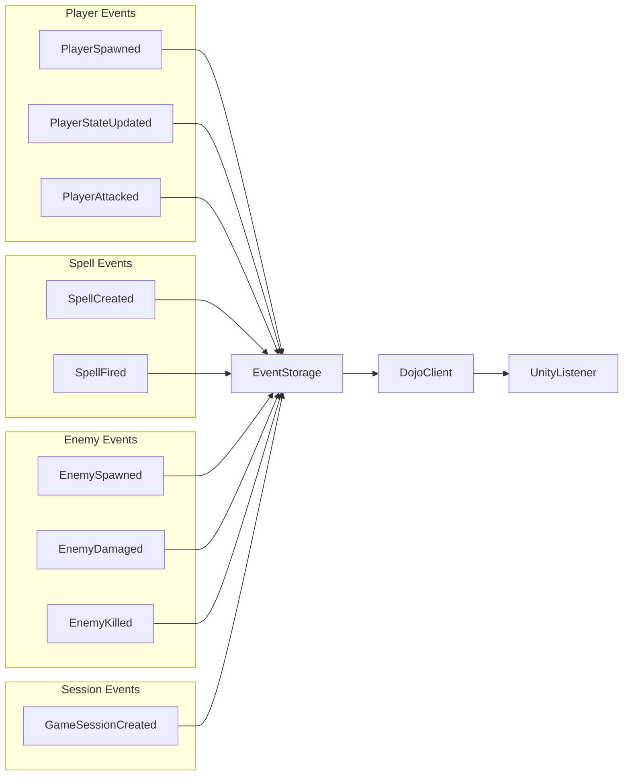
```mermaid
graph LR
    subgraph "Player Events"
        PE1[PlayerSpawned]
        PE2[PlayerStateUpdated]
        PE3[PlayerAttacked]
    end
    
    subgraph "Spell Events"
        SE1[SpellCreated]
        SE2[SpellFired]
    end
    
    subgraph "Enemy Events"
        EE1[EnemySpawned]
        EE2[EnemyDamaged]
        EE3[EnemyKilled]
    end
    
    subgraph "Session Events"
        GE1[GameSessionCreated]
    end
    
    PE1 --> EventStorage
    PE2 --> EventStorage
    PE3 --> EventStorage
    SE1 --> EventStorage
    SE2 --> EventStorage
    EE1 --> EventStorage
    EE2 --> EventStorage
    EE3 --> EventStorage
    GE1 --> EventStorage
    
    EventStorage --> DojoClient
    DojoClient --> UnityListener
```

---

## Unity Integration

### Project Structure

```
unity/
├── .plastic/                    # Version control
├── Assets/
│   ├── BlockChain/             # Dojo integration scripts
│   ├── Dojo/                   # Dojo SDK
│   ├── MyDojo/                 # Custom Dojo implementations
│   ├── Scripts/                # Game logic
│   │   ├── DojoManager.cs     # Starknet connection manager
│   │   ├── DojoActions.cs     # Contract interaction wrapper
│   │   └── PlayerDojo.cs      # Player state synchronization
│   ├── Multiplayer/            # PurrNet multiplayer system
│   ├── Prefabs/                # Game objects
│   ├── Graphics/               # Visual assets
│   ├── VFX/                    # Particle effects
│   └── Dungeon/                # Level design
├── Packages/                   # Unity packages
├── ProjectSettings/            # Unity configuration
└── UserSettings/               # User preferences
```

### Key C# Scripts

#### DojoManager.cs
Central manager for Starknet connectivity and account management.

```csharp
public class DojoManager : MonoBehaviour
{
    public static DojoManager Instance { get; private set; }
    
    [Header("Starknet Settings")]
    public string rpcUrl;               // Starknet Sepolia RPC endpoint
    public string accountAddress;       // Player wallet address
    public string privateKey;           // Signing key
    public string actionsContract;      // Deployed contract address
    
    public Account Account { get; private set; }
    public Actions Actions { get; private set; }
    public bool IsInitialized { get; private set; }
}
```

**Initialization Flow:**
1. Creates JsonRpcClient with Alchemy RPC URL
2. Generates SigningKey from private key
3. Instantiates Account with provider, signer, and address
4. Attaches Actions component with contract address
5. Sets IsInitialized flag for other scripts

#### DojoActions.cs
Static wrapper providing clean API for contract interactions.

**Available Methods:**
- `SpawnPlayer()`: Initialize player on-chain
- `UpdatePlayerState(state, pos_x, pos_y, facing_dir, velocity)`: Sync game state
- `CreateSpell(...)`: Define new spell with 17 parameters
- `FireSpell(spell_id, origin_x, origin_y, direction)`: Cast equipped spell
- `EquipSpell(spell_id)`: Add spell to active loadout
- `TakeDamage(damage)`: Apply damage to player
- `CreateEnemy(pos_x, pos_y, enemy_type)`: Spawn enemy entity
- `DamageEnemy(enemy_id, damage)`: Apply damage to enemy
- `EnemyKilled(enemy_id)`: Mark enemy as dead

**Error Handling:**
All methods include try-catch blocks with Unity Debug logging for transaction failures.

#### PlayerDojo.cs
Manages periodic state synchronization between Unity and blockchain.

**Synchronization Strategy:**
- Updates every 0.5 seconds (configurable)
- Fire-and-forget async pattern to prevent blocking
- Reads Unity Transform position
- Converts Player script state to PlayerFSMState enum
- Calculates velocity magnitude
- Determines facing direction (left/right)

### Dojo Bindings

Auto-generated C# bindings from Cairo contracts located in `bindings/unity/`:

**Actions.gen.cs**
- Generated by dojo-bindgen
- Contains C# method signatures matching Cairo systems
- Handles FieldElement conversions
- Manages calldata serialization
- Constructs Call objects for ExecuteRaw

**Type Mappings:**
- `felt252` → `FieldElement`
- `u16` → `ushort`
- `i32` → `int`
- `i16` → `short`
- `u8` → `byte`
- `ContractAddress` → `FieldElement`
- Enums → `Enum.GetIndex()` for serialization

### Multiplayer Implementation

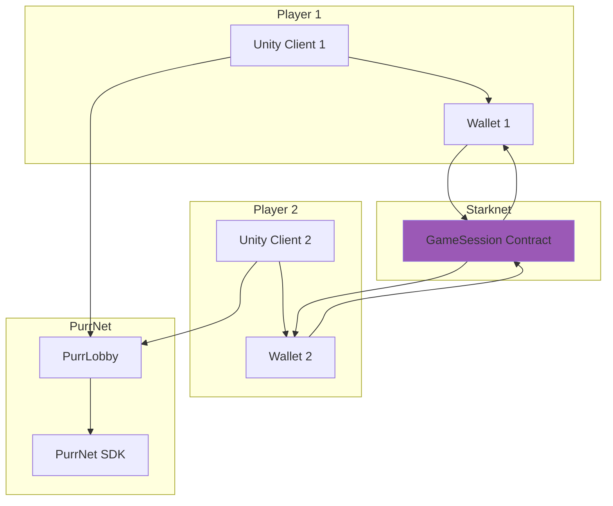
```mermaid
graph TB
    subgraph "Player 1"
        P1[Unity Client 1]
        W1[Wallet 1]
    end
    
    subgraph "Player 2"
        P2[Unity Client 2]
        W2[Wallet 2]
    end
    
    subgraph "PurrNet"
        PN[PurrLobby]
        PS[PurrNet SDK]
    end
    
    subgraph "Starknet"
        GS[GameSession Contract]
    end
    
    P1 --> PN
    P2 --> PN
    PN --> PS
    P1 --> W1
    P2 --> W2
    W1 --> GS
    W2 --> GS
    GS --> W1
    GS --> W2
    
    style GS fill:#9B59B6
```

**Session Creation Flow:**
1. Player 1 initiates match via Unity UI
2. PurrLobby matches with Player 2
3. Player 1 calls `create_game_session(player_2_address)`
4. Starknet generates unique session_id using Poseidon hash
5. GameSession component stores both player addresses
6. Both clients receive session_id via events
7. Synchronized combat begins

---

## Installation & Setup

### Prerequisites

**Blockchain Tools:**
- Dojo v0.7.0 or higher
- Scarb v2.6.3 or higher
- Starkli v0.2.9 or higher
- Cairo v2.6.3 or higher

**Unity Requirements:**
- Unity 6.2 LTS or higher
- .NET Standard 2.1
- Universal Render Pipeline (URP)

**Development Tools:**
- Git
- Visual Studio Code with Cairo extension
- Unity Hub

### Smart Contract Setup

**1. Clone Repository**
```bash
git clone https://github.com/Vinayak-RZ/Chains-Of-Eternity-Starknet.git
cd Chains-Of-Eternity-Starknet/arcane
```

**2. Install Dependencies**
```bash
# Initialize Dojo project
dojo init

# Verify installation
dojo --version
scarb --version
```

**3. Build Contracts**
```bash
# Compile Cairo contracts
scarb build

# Verify build output
ls target/dev/
```

**4. Start Local Node**
```bash
# Launch Katana (local Starknet node)
katana --disable-fee

# Output shows:
# - RPC endpoint: http://localhost:5050
# - Prefunded accounts with private keys
```

**5. Deploy Contracts**
```bash
# Deploy to Katana
dojo migrate --rpc-url http://localhost:5050

# Note the deployed contract addresses:
# - actions: 0x...
# - models: 0x...

# For Sepolia testnet:
dojo migrate --rpc-url https://starknet-sepolia.g.alchemy.com/... \
  --account <account_file> \
  --private-key <private_key>
```

**6. Generate Bindings**
```bash
# Generate Unity C# bindings
dojo bindgen unity

# Output location: bindings/unity/
# Files: Actions.gen.cs, Models.gen.cs
```

### Unity Client Setup

**1. Open Project**
```bash
cd unity
# Open in Unity Hub
```

**2. Import Dojo SDK**
- Locate Dojo SDK package in `Assets/Dojo/`
- Verify package installation in Package Manager

**3. Configure DojoManager**
- Open `Assets/BlockChain/DojoManager.cs`
- Update configuration:

```csharp
public string rpcUrl = "http://localhost:5050";  // or Sepolia RPC
public string accountAddress = "0x...";           // Your wallet address
public string privateKey = "0x...";               // Your private key
public string actionsContract = "0x...";          // Deployed contract address
```

**4. Copy Generated Bindings**
```bash
# Copy from arcane/bindings/unity/ to unity/Assets/MyDojo/
cp ../arcane/bindings/unity/*.cs Assets/MyDojo/
```

**5. Build and Run**
- Open scene: `Assets/DungeonMultiplayer.unity`
- Press Play in Unity Editor
- Monitor Console for Dojo initialization logs

### Wallet Setup

**For Development:**
- Use Katana prefunded accounts
- Account 0: `youraccountid`
- Private Key: `yourprivatekey`

**For Testnet:**
- Install Argent X or Braavos wallet
- Get Sepolia ETH from faucet
- Export private key from wallet
- Configure in DojoManager

---

## Gameplay Mechanics

### Player Lifecycle

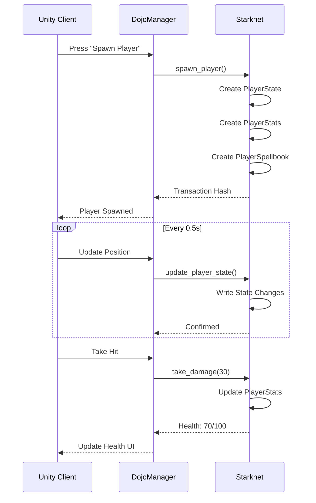
```mermaid
sequenceDiagram
    participant U as Unity Client
    participant D as DojoManager
    participant S as Starknet
    
    U->>D: Press "Spawn Player"
    D->>S: spawn_player()
    S->>S: Create PlayerState
    S->>S: Create PlayerStats
    S->>S: Create PlayerSpellbook
    S-->>D: Transaction Hash
    D-->>U: Player Spawned
    
    loop Every 0.5s
        U->>D: Update Position
        D->>S: update_player_state()
        S->>S: Write State Changes
        S-->>D: Confirmed
    end
    
    U->>D: Take Hit
    D->>S: take_damage(30)
    S->>S: Update PlayerStats
    S-->>D: Health: 70/100
    D-->>U: Update Health UI
```

### Spell Creation & Casting

**Creation Flow:**
1. Player opens spell crafting UI
2. Selects element (Fire/Water/Lightning/Wind)
3. Adjusts 17 parameters via sliders
4. Preview shows projectile behavior
5. Confirms and submits to blockchain
6. `create_spell()` writes SpellCore component
7. Spell appears in player's collection

**Casting Flow:**
1. Player equips spell from collection
2. `equip_spell()` adds to active loadout
3. During gameplay, player presses attack button
4. Unity calculates origin position and direction
5. `fire_spell()` creates SpellInstance
6. Blockchain records timestamp and caster
7. Unity renders projectile visually
8. Collision detection triggers `player_attacked()`

### Combat Resolution

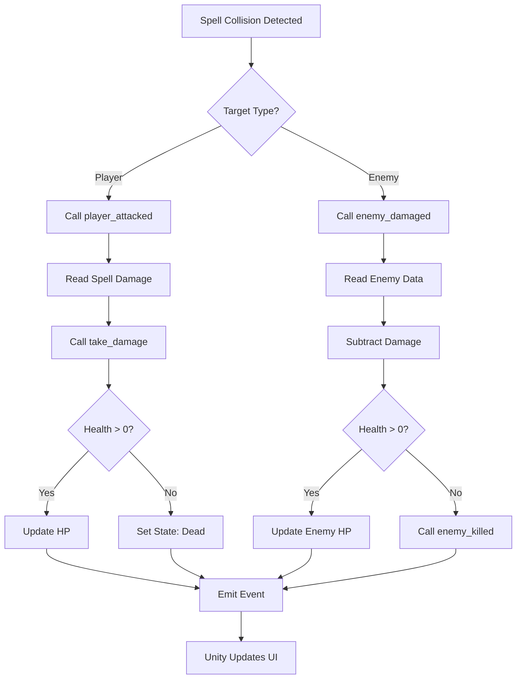
```mermaid
graph TD
    A[Spell Collision Detected] --> B{Target Type?}
    B -->|Player| C[Call player_attacked]
    B -->|Enemy| D[Call enemy_damaged]
    
    C --> E[Read Spell Damage]
    E --> F[Call take_damage]
    F --> G{Health > 0?}
    G -->|Yes| H[Update HP]
    G -->|No| I[Set State: Dead]
    
    D --> J[Read Enemy Data]
    J --> K[Subtract Damage]
    K --> L{Health > 0?}
    L -->|Yes| M[Update Enemy HP]
    L -->|No| N[Call enemy_killed]
    
    H --> O[Emit Event]
    I --> O
    M --> O
    N --> O
    O --> P[Unity Updates UI]
```

### Enemy Behavior

**Spawn Mechanics:**
- Enemy spawner calls `spawn_enemy(x, y, type)`
- Blockchain generates unique enemy_id
- Type determines stats (Witch or Boss)
- Position recorded on-chain
- Unity instantiates visual prefab

**AI Pattern (Off-Chain):**
- Unity handles pathfinding and movement
- On-hit detection, Unity calls `enemy_damaged()`
- Blockchain validates and updates health
- On death, `enemy_killed()` finalizes state

**Loot System (Future):**
- VRF integration for random drops
- Experience points awarded to killer
- Item NFTs minted to player address

---

## Technical Stack

### Blockchain Layer

| Component | Technology | Purpose |
|-----------|-----------|---------|
| Smart Contract Language | Cairo | Type-safe, provable computation |
| Blockchain Network | Starknet Sepolia | Layer 2 scalability solution |
| ECS Framework | Dojo | Entity-component architecture |
| Consensus | Starknet Sequencer | Transaction ordering and execution |
| Storage | Starknet State | Persistent game state |
| RPC Provider | Alchemy | Node infrastructure |

### Unity Client

| Component | Technology | Purpose |
|-----------|-----------|---------|
| Game Engine | Unity 2022.3 LTS | Cross-platform game development |
| Rendering | Universal Render Pipeline | Modern graphics pipeline |
| Multiplayer | PurrNet SDK | Real-time player synchronization |
| Networking | PurrLobby | Matchmaking and lobby system |
| Blockchain Integration | Dojo Unity SDK | C# bindings for Cairo contracts |
| Wallet | Cartridge Controller | Session-based authentication |

### Development Tools

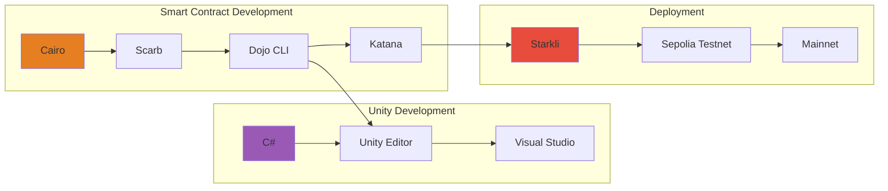
```mermaid
graph LR
    subgraph "Smart Contract Development"
        A[Cairo] --> B[Scarb]
        B --> C[Dojo CLI]
        C --> D[Katana]
    end
    
    subgraph "Unity Development"
        E[C#] --> F[Unity Editor]
        F --> G[Visual Studio]
    end
    
    subgraph "Deployment"
        H[Starkli] --> I[Sepolia Testnet]
        I --> J[Mainnet]
    end
    
    D --> H
    C --> F
    
    style A fill:#E67E22
    style E fill:#9B59B6
    style H fill:#E74C3C
```

---

## Development Workflow

### Adding a New System

**1. Define Cairo System**
```cairo
// src/systems/actions.cairo
fn new_system(ref self: ContractState, param: u16) {
    let mut world = self.world_default();
    let player = get_caller_address();
    
    // Read component
    let mut component: MyComponent = world.read_model(player);
    
    // Update logic
    component.value += param;
    
    // Write back
    world.write_model(@component);
    
    // Emit event
    world.emit_event(@MyEvent { player, param });
}
```

**2. Add to Interface**
```cairo
// src/systems/actions.cairo
#[starknet::interface]
pub trait IActions<T> {
    fn new_system(ref self: T, param: u16);
}
```

**3. Rebuild and Deploy**
```bash
scarb build
dojo migrate --rpc-url http://localhost:5050
```

**4. Regenerate Bindings**
```bash
dojo bindgen unity
cp bindings/unity/*.cs ../unity/Assets/MyDojo/
```

**5. Add C# Wrapper**
```csharp
// Assets/Scripts/DojoActions.cs
public static async Task<FieldElement> NewSystem(ushort param)
{
    EnsureReady();
    var tx = await Actions.new_system(Account, param);
    return tx;
}
```

**6. Call from Unity**
```csharp
await DojoActions.NewSystem(100);
```

### Testing Strategy

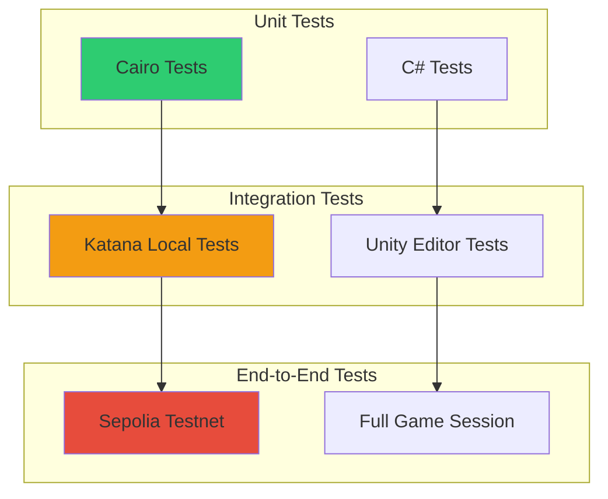
```mermaid
graph TB
    subgraph "Unit Tests"
        UT1[Cairo Tests]
        UT2[C# Tests]
    end
    
    subgraph "Integration Tests"
        IT1[Katana Local Tests]
        IT2[Unity Editor Tests]
    end
    
    subgraph "End-to-End Tests"
        E2E1[Sepolia Testnet]
        E2E2[Full Game Session]
    end
    
    UT1 --> IT1
    UT2 --> IT2
    IT1 --> E2E1
    IT2 --> E2E2
    
    style UT1 fill:#2ECC71
    style IT1 fill:#F39C12
    style E2E1 fill:#E74C3C
```

**Cairo Testing:**
```bash
# Run contract tests
scarb test

# Test specific module
scarb test test_spawn_player
```

**Unity Testing:**
```csharp
// Assets/Tests/DojoIntegrationTests.cs
[Test]
public async Task TestSpawnPlayer()
{
    await DojoActions.SpawnPlayer();
    // Assert transaction success
}
```

### Debugging

**Contract Debugging:**
- Use `println!()` in Cairo for debug output
- Monitor Katana logs for transaction traces
- Use Starknet Voyager for testnet transactions

**Unity Debugging:**
- Check Console for transaction hashes
- Monitor DojoManager initialization status
- Use Unity Profiler for performance issues

**Common Issues:**

| Issue | Cause | Solution |
|-------|-------|----------|
| Transaction Fails | Insufficient gas | Increase max_fee in Account |
| Binding Errors | Outdated generated code | Regenerate with `dojo bindgen` |
| State Desync | Network latency | Implement retry logic |
| Null Reference | DojoManager not initialized | Check IsInitialized flag |

---

## Deployment

### Local Deployment (Development)

**1. Start Katana**
```bash
# Terminal 1: Run local node
cd arcane
katana --disable-fee

# Keep running in background
```

**2. Deploy Contracts**
```bash
# Terminal 2: Deploy to local node
dojo migrate --rpc-url http://localhost:5050

# Save output:
# World: 0x...
# Actions: 0x...
```

**3. Start Torii Indexer**
```bash
# Terminal 3: Run indexer for event streaming
torii --world 0x... --rpc http://localhost:5050

# GraphQL endpoint: http://localhost:8080
```

**4. Launch Unity**
- Configure DojoManager with local addresses
- Press Play
- Test all systems locally

### Testnet Deployment (Sepolia)

**1. Prepare Account**
```bash
# Create account file
starkli account fetch <address> --output ~/.starkli-wallets/account.json

# Add to .env
export STARKNET_ACCOUNT=~/.starkli-wallets/account.json
export STARKNET_RPC=https://starknet-sepolia.g.alchemy.com/...
```

**2. Fund Account**
- Get Sepolia ETH from [Starknet Faucet](https://faucet.goerli.starknet.io/)
- Minimum 0.1 ETH recommended

**3. Deploy to Sepolia**
```bash
# Build contracts
scarb build

# Deploy with account
dojo migrate \
  --rpc-url $STARKNET_RPC \
  --account $STARKNET_ACCOUNT \
  --private-key $PRIVATE_KEY

# Wait for confirmation (2-5 minutes)
```

**4. Verify Deployment**
```bash
# Check on Voyager
# https://sepolia.voyager.online/contract/0x...

# Test read operation
starkli call <actions_contract> spawn_player
```

**5. Update Unity Configuration**
```csharp
// DojoManager.cs
public string rpcUrl = "https://starknet-sepolia.g.alchemy.com/...";
public string actionsContract = "0x...";  // From deployment output
```

### Production Deployment (Mainnet)

**Prerequisites:**
- Audited smart contracts
- Comprehensive test coverage
- Mainnet wallet with funds
- Production RPC endpoint

**Security Checklist:**
- [ ] All tests passing
- [ ] Security audit completed
- [ ] Private keys secured
- [ ] Rate limiting configured
- [ ] Emergency pause mechanism
- [ ] Multi-sig wallet for admin functions

**Deployment Process:**
```bash
# 1. Final build
scarb build --release

# 2. Deploy to mainnet
dojo migrate \
  --rpc-url https://starknet-mainnet.g.alchemy.com/... \
  --account <mainnet_account> \
  --private-key <secure_key>

# 3. Verify on Starkscan
# https://starkscan.co/contract/0x...

# 4. Update production Unity build
# 5. Publish to app stores
```

---

## Gameplay Mechanics

### Spell Crafting System

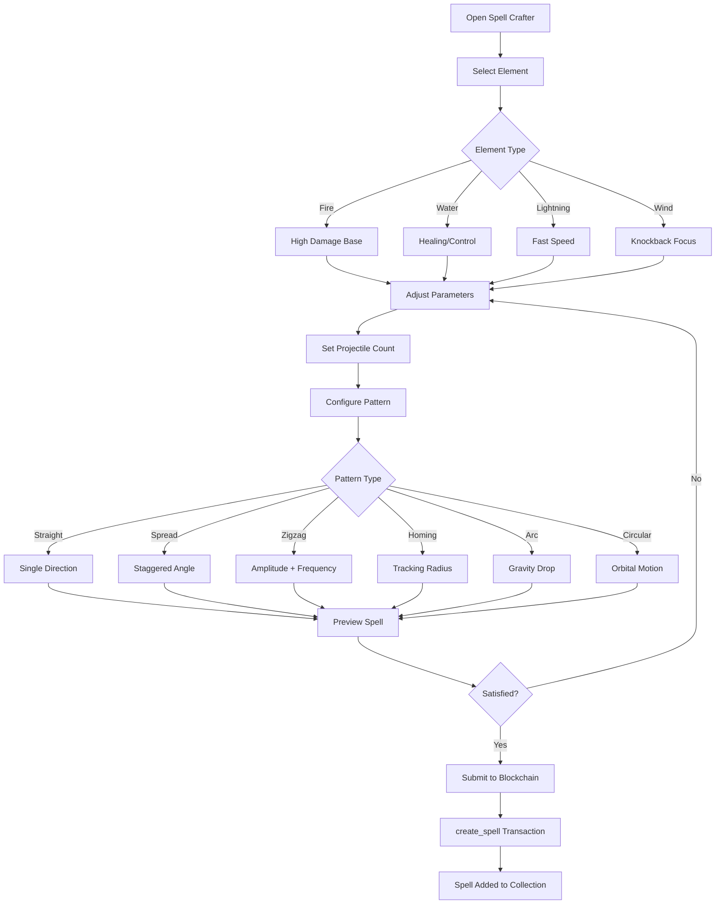
```mermaid
graph TD
    A[Open Spell Crafter] --> B[Select Element]
    B --> C{Element Type}
    C -->|Fire| D[High Damage Base]
    C -->|Water| E[Healing/Control]
    C -->|Lightning| F[Fast Speed]
    C -->|Wind| G[Knockback Focus]
    
    D --> H[Adjust Parameters]
    E --> H
    F --> H
    G --> H
    
    H --> I[Set Projectile Count]
    I --> J[Configure Pattern]
    J --> K{Pattern Type}
    K -->|Straight| L[Single Direction]
    K -->|Spread| M[Staggered Angle]
    K -->|Zigzag| N[Amplitude + Frequency]
    K -->|Homing| O[Tracking Radius]
    K -->|Arc| P[Gravity Drop]
    K -->|Circular| Q[Orbital Motion]
    
    L --> R[Preview Spell]
    M --> R
    N --> R
    O --> R
    P --> R
    Q --> R
    
    R --> S{Satisfied?}
    S -->|No| H
    S -->|Yes| T[Submit to Blockchain]
    T --> U[create_spell Transaction]
    U --> V[Spell Added to Collection]
```

**Parameter Guidelines:**

| Parameter | Range | Effect | Strategy |
|-----------|-------|--------|----------|
| damage | 10-100 | Base damage per hit | Balance with mana cost |
| projectile_speed | 50-500 | Travel velocity | Higher = harder to dodge |
| projectile_size | 10-100 | Hitbox radius | Larger = easier to hit |
| number_of_projectiles | 1-10 | Multi-shot | Spreads damage |
| staggered_angle | 0-180 | Spread cone | Wide for area coverage |
| mana_cost | 10-100 | Resource drain | Limit spam potential |
| cooldown | 500-5000 | Recast delay (ms) | Balance power vs frequency |

### Combat Mechanics

**Damage Calculation:**
```cairo
// Base damage from spell
let base_damage = spell_core.damage;

// Future: Apply elemental modifiers
// let modifier = get_element_modifier(attacker.element, defender.element);
// let final_damage = base_damage * modifier / 100;

// Current: Direct damage
let final_damage = base_damage;
```

**Knockback Physics:**
- Knockback force stored in SpellCore
- Unity applies physics impulse on hit
- Direction based on spell trajectory
- Can interrupt player actions

**Status Effects (Planned):**
- Burn (Fire): Damage over time
- Freeze (Water): Movement slow
- Stun (Lightning): Action disable
- Push (Wind): Forced displacement

### Progression System

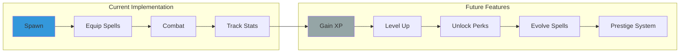
```mermaid
graph LR
    subgraph "Current Implementation"
        A[Spawn] --> B[Equip Spells]
        B --> C[Combat]
        C --> D[Track Stats]
    end
    
    subgraph "Future Features"
        E[Gain XP] --> F[Level Up]
        F --> G[Unlock Perks]
        G --> H[Evolve Spells]
        H --> I[Prestige System]
    end
    
    D --> E
    
    style A fill:#3498DB
    style E fill:#95A5A6
```

**Current Stats Tracked:**
- `spell_damage_dealt`: Total damage output
- `spells_fired`: Total casts
- `health`: Survival metric
- `mana`: Resource management

**Planned Additions:**
- Experience points from kills
- Level-based stat increases
- Spell evolution trees
- Achievement system
- Leaderboards

---

## Advanced Features

### Multiplayer Architecture

**Session Management:**

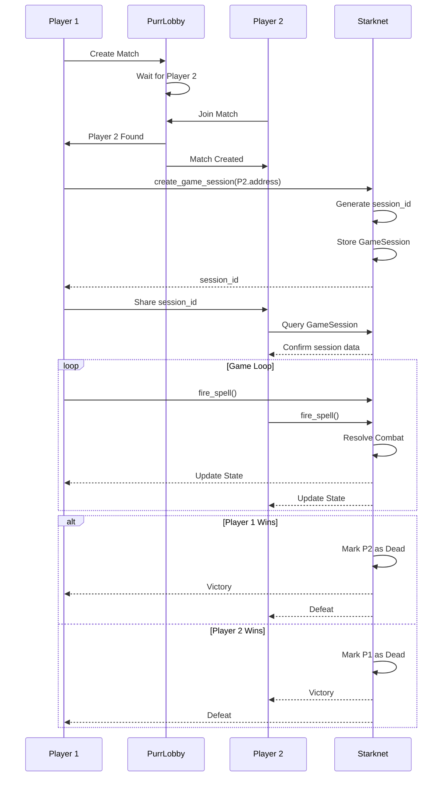
```mermaid
sequenceDiagram
    participant P1 as Player 1
    participant Lobby as PurrLobby
    participant P2 as Player 2
    participant Chain as Starknet
    
    P1->>Lobby: Create Match
    Lobby->>Lobby: Wait for Player 2
    P2->>Lobby: Join Match
    Lobby->>P1: Player 2 Found
    Lobby->>P2: Match Created
    
    P1->>Chain: create_game_session(P2.address)
    Chain->>Chain: Generate session_id
    Chain->>Chain: Store GameSession
    Chain-->>P1: session_id
    
    P1->>P2: Share session_id
    P2->>Chain: Query GameSession
    Chain-->>P2: Confirm session data
    
    loop Game Loop
        P1->>Chain: fire_spell()
        P2->>Chain: fire_spell()
        Chain->>Chain: Resolve Combat
        Chain-->>P1: Update State
        Chain-->>P2: Update State
    end
    
    alt Player 1 Wins
        Chain->>Chain: Mark P2 as Dead
        Chain-->>P1: Victory
        Chain-->>P2: Defeat
    else Player 2 Wins
        Chain->>Chain: Mark P1 as Dead
        Chain-->>P2: Victory
        Chain-->>P1: Defeat
    end
```

**Synchronization Strategy:**
- Position updates: 2 Hz (every 0.5s)
- Combat actions: Immediate on input
- State reconciliation: Event-driven
- Latency handling: Client-side prediction

**Anti-Cheat Measures:**
- All combat resolution on-chain
- State transitions validated by Cairo
- Movement bounds enforced
- Rate limiting on actions

### VRF Integration (Planned)

**Random Quest Generation:**

```cairo
use starknet_vrf::VRF;

fn generate_quest(ref self: ContractState) -> Quest {
    let random_seed = VRF::get_random_value();
    
    let quest_type = random_seed % 5;  // 5 quest types
    let difficulty = (random_seed / 5) % 3;  // Easy/Medium/Hard
    let reward = calculate_reward(difficulty);
    
    Quest {
        quest_type,
        difficulty,
        reward,
        expires_at: get_block_timestamp() + 86400,  // 24 hours
    }
}
```

**Loot Drop System:**
- VRF generates random item on enemy kill
- Item rarity determined by probability distribution
- Items minted as ERC-721 NFTs
- Tradeable on secondary markets

### Composability Examples

**Cross-World Spell Sharing:**

```cairo
// World A creates spell
world_a.create_spell(spell_id, params...);

// World B can read and use the same spell
let spell = world_b.read_model(spell_id);
world_b.fire_spell(spell_id, ...);
```

**Guild System (Future):**

```cairo
pub struct Guild {
    pub guild_id: felt252,
    pub name: ByteArray,
    pub members: Array<ContractAddress>,
    pub shared_spells: Array<felt252>,
    pub territory: Vec2i,
}

// Guild members can access shared spell pool
fn cast_guild_spell(ref self: ContractState, spell_id: felt252) {
    let guild = get_player_guild(caller);
    assert!(guild.shared_spells.contains(spell_id));
    // Cast spell with guild bonuses
}
```

---

## Performance Optimization

### Gas Optimization

**Component Size Reduction:**
```cairo
// Before: Large struct
pub struct PlayerState {
    pub player: ContractAddress,
    pub health: u256,  // Unnecessary precision
    pub position_x: u256,
    pub position_y: u256,
}

// After: Optimized
pub struct PlayerState {
    pub player: ContractAddress,
    pub health: u16,  // Max 65,535 HP
    pub position: Vec2i,  // Packed struct
}
```

**Batch Operations:**
```cairo
// Instead of multiple transactions
fn update_multiple_stats(
    ref self: ContractState,
    health: u16,
    mana: u16,
    position: Vec2i
) {
    let mut stats: PlayerStats = world.read_model(player);
    stats.health = health;
    stats.mana = mana;
    // Single write
    world.write_model(@stats);
}
```

### Unity Optimization

**Object Pooling:**
```csharp
// Pool for spell projectiles
public class ProjectilePool : MonoBehaviour
{
    private Queue<GameObject> pool = new Queue<GameObject>();
    
    public GameObject GetProjectile()
    {
        if (pool.Count > 0)
            return pool.Dequeue();
        return Instantiate(projectilePrefab);
    }
    
    public void ReturnProjectile(GameObject obj)
    {
        obj.SetActive(false);
        pool.Enqueue(obj);
    }
}
```

**State Update Batching:**
```csharp
private List<StateUpdate> pendingUpdates = new List<StateUpdate>();

private void Update()
{
    // Collect updates
    if (HasStateChanged())
        pendingUpdates.Add(new StateUpdate(...));
    
    // Batch send every 0.5s
    if (Time.time - lastSync > 0.5f)
    {
        SendBatchUpdate(pendingUpdates);
        pendingUpdates.Clear();
        lastSync = Time.time;
    }
}
```

### Transaction Monitoring

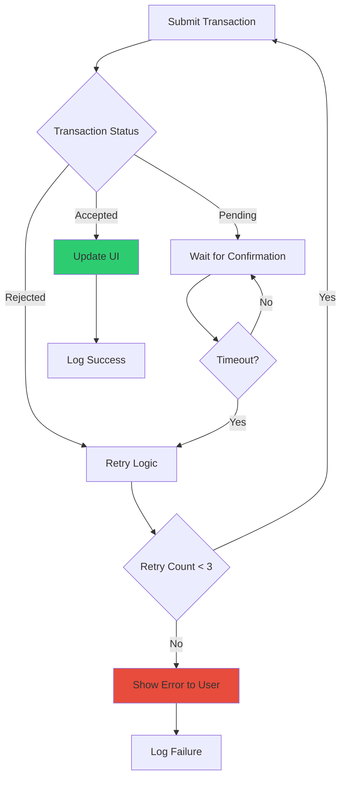
```mermaid
graph TD
    A[Submit Transaction] --> B{Transaction Status}
    B -->|Pending| C[Wait for Confirmation]
    B -->|Accepted| D[Update UI]
    B -->|Rejected| E[Retry Logic]
    
    C --> F{Timeout?}
    F -->|No| C
    F -->|Yes| E
    
    E --> G{Retry Count < 3}
    G -->|Yes| A
    G -->|No| H[Show Error to User]
    
    D --> I[Log Success]
    H --> J[Log Failure]
    
    style D fill:#2ECC71
    style H fill:#E74C3C
```

---

## API Reference

### Cairo Systems

#### spawn_player
```cairo
fn spawn_player(ref self: ContractState)
```
Initializes a new player with default stats and empty spellbook.

**Emits:** `PlayerSpawned`

**Gas Cost:** ~150,000 gas

---

#### update_player_state
```cairo
fn update_player_state(
    ref self: ContractState,
    new_state: PlayerFSMState,
    pos_x: i32,
    pos_y: i32,
    facing_dir: i16,
    velocity: i16
)
```
Updates player position and FSM state.

**Parameters:**
- `new_state`: Target FSM state (Idle/Running/Dashing/Attacking/Dead)
- `pos_x`, `pos_y`: World coordinates
- `facing_dir`: Direction in degrees × 100
- `velocity`: Movement speed

**Emits:** `PlayerStateUpdated`

**Gas Cost:** ~80,000 gas

---

#### create_spell
```cairo
fn create_spell(
    ref self: ContractState,
    spell_id: felt252,
    element: SpellElement,
    attack_subtype: AttackSubtype,
    damage: u16,
    knockback: u16,
    projectile_speed: u16,
    projectile_size: u16,
    number_of_projectiles: u8,
    staggered_angle: i16,
    zigzag_amplitude: u16,
    zigzag_frequency: u16,
    homing_radius: u16,
    arc_gravity: u16,
    random_offset: u16,
    circular_speed: u16,
    circular_radius: u16,
    mana_cost: u16,
    cooldown: u16
)
```
Creates a new spell with specified parameters.

**Emits:** `SpellCreated`

**Gas Cost:** ~200,000 gas

---

#### fire_spell
```cairo
fn fire_spell(
    ref self: ContractState,
    spell_id: felt252,
    origin_x: i32,
    origin_y: i32,
    direction: i16
)
```
Casts a spell, creating a SpellInstance entity.

**Emits:** `SpellFired`

**Gas Cost:** ~120,000 gas

---

#### take_damage
```cairo
fn take_damage(ref self: ContractState, damage: u16)
```
Applies damage to caller, potentially killing them.

**Gas Cost:** ~90,000 gas

---

### Unity C# Methods

#### DojoActions.SpawnPlayer
```csharp
public static async Task<FieldElement> SpawnPlayer()
```
Spawns player on-chain.

**Returns:** Transaction hash

**Example:**
```csharp
var txHash = await DojoActions.SpawnPlayer();
Debug.Log($"Spawned: {txHash.Inner}");
```

---

#### DojoActions.CreateSpell
```csharp
public static async Task<FieldElement> CreateSpell(
    FieldElement spell_id,
    SpellElement element,
    AttackSubtype attackSubtype,
    ushort damage,
    ushort knockback,
    ushort projectile_speed,
    ushort projectile_size,
    byte number_of_projectiles,
    short staggered_angle,
    ushort zigzag_amplitude,
    ushort zigzag_frequency,
    ushort homing_radius,
    ushort arc_gravity,
    ushort random_offset,
    ushort circular_speed,
    ushort circular_radius,
    ushort mana_cost,
    ushort cooldown
)
```

**Example:**
```csharp
var spellId = new FieldElement("0x123");
await DojoActions.CreateSpell(
    spellId,
    new SpellElement.Fire(),
    new AttackSubtype.Projectile(),
    damage: 50,
    knockback: 10,
    projectile_speed: 200,
    projectile_size: 20,
    number_of_projectiles: 1,
    staggered_angle: 0,
    zigzag_amplitude: 0,
    zigzag_frequency: 0,
    homing_radius: 0,
    arc_gravity: 0,
    random_offset: 0,
    circular_speed: 0,
    circular_radius: 0,
    mana_cost: 20,
    cooldown: 1000
);
```

---

## Contributing

### Development Setup

**1. Fork Repository**
```bash
git clone https://github.com/YOUR_USERNAME/Chains-Of-Eternity-Starknet.git
cd Chains-Of-Eternity-Starknet
```

**2. Create Feature Branch**
```bash
git checkout -b feature/new-spell-system
```

**3. Make Changes**
- Follow Cairo style guide
- Add tests for new systems
- Update documentation

**4. Test Locally**
```bash
# Test Cairo contracts
cd arcane
scarb test

# Test Unity integration
# Open Unity project and run play mode tests
```

**5. Submit Pull Request**
- Clear description of changes
- Reference related issues
- Include test results

### Coding Standards

**Cairo Conventions:**
- Use snake_case for functions and variables
- Use PascalCase for structs and enums
- Document all public interfaces
- Include error messages in assertions

**C# Conventions:**
- Follow Microsoft C# guidelines
- Use async/await for blockchain calls
- Handle exceptions gracefully
- Log all transaction hashes

### Reporting Issues

**Bug Reports:**
- Unity version
- Starknet network (Katana/Sepolia/Mainnet)
- Contract addresses
- Transaction hashes
- Console logs
- Steps to reproduce

**Feature Requests:**
- Clear use case description
- Expected behavior
- Potential implementation approach

---

## Roadmap

### Phase 1: Core Mechanics (Current)
- [x] Player spawn and state management
- [x] Spell creation with 17 parameters
- [x] PvP combat resolution
- [x] Enemy spawning and damage
- [x] Unity-Dojo integration
- [x] Multiplayer sessions

### Phase 2: Enhanced Gameplay (Q1 2026)
- [ ] VRF-based quest generation
- [ ] Random loot drops
- [ ] Experience and leveling system
- [ ] Spell evolution mechanics
- [ ] Achievement system
- [ ] Leaderboards

### Phase 3: Economy & Social (Q2 2026)
- [ ] Item NFTs (ERC-721)
- [ ] Spell marketplace (ERC-20 trading)
- [ ] Guild system
- [ ] Territory control
- [ ] Staking rewards
- [ ] Governance tokens

### Phase 4: Cross-World (Q3 2026)
- [ ] Cross-world spell migration
- [ ] Shared component libraries
- [ ] Inter-world tournaments
- [ ] Composable NPC systems
- [ ] World-to-world bridges

### Phase 5: Advanced Features (Q4 2026)
- [ ] AI-driven NPCs with on-chain behavior
- [ ] Dynamic world events
- [ ] Seasonal content updates
- [ ] Mobile client (iOS/Android)
- [ ] Web client (WebGL)

---

## License

This project is licensed under the MIT License.

```
MIT License

Copyright (c) 2025 ARCANE Development Team

Permission is hereby granted, free of charge, to any person obtaining a copy
of this software and associated documentation files (the "Software"), to deal
in the Software without restriction, including without limitation the rights
to use, copy, modify, merge, publish, distribute, sublicense, and/or sell
copies of the Software, and to permit persons to whom the Software is
furnished to do so, subject to the following conditions:

The above copyright notice and this permission notice shall be included in all
copies or substantial portions of the Software.

THE SOFTWARE IS PROVIDED "AS IS", WITHOUT WARRANTY OF ANY KIND, EXPRESS OR
IMPLIED, INCLUDING BUT NOT LIMITED TO THE WARRANTIES OF MERCHANTABILITY,
FITNESS FOR A PARTICULAR PURPOSE AND NONINFRINGEMENT. IN NO EVENT SHALL THE
AUTHORS OR COPYRIGHT HOLDERS BE LIABLE FOR ANY CLAIM, DAMAGES OR OTHER
LIABILITY, WHETHER IN AN ACTION OF CONTRACT, TORT OR OTHERWISE, ARISING FROM,
OUT OF OR IN CONNECTION WITH THE SOFTWARE OR THE USE OR OTHER DEALINGS IN THE
SOFTWARE.
```

---

## Acknowledgments

**Built With:**
- [Dojo](https://www.dojoengine.org/) - On-chain game engine
- [Starknet](https://www.starknet.io/) - Layer 2 scaling solution
- [Cairo](https://www.cairo-lang.org/) - Smart contract language
- [Unity](https://unity.com/) - Game development platform
- [PurrNet](https://purrnet.io/) - Multiplayer networking

**Special Thanks:**
- Dojo community for ECS framework
- Starknet Foundation for developer support
- Cartridge team for wallet SDK
- All contributors and testers

---

## Contact & Community

**Project Repository:** [GitHub](https://github.com/Vinayak-RZ/Chains-Of-Eternity-Starknet)

**Documentation:** This README

**Issues & Bugs:** [GitHub Issues](https://github.com/Vinayak-RZ/Chains-Of-Eternity-Starknet/issues)

**Discussions:** [GitHub Discussions](https://github.com/Vinayak-RZ/Chains-Of-Eternity-Starknet/discussions)

---

## Appendix

### Glossary

**Cairo:** Programming language for writing provable programs on Starknet

**Dojo:** Entity Component System framework for on-chain games

**ECS:** Entity Component System architecture pattern

**FSM:** Finite State Machine for managing entity states

**Felt:** Field element, the basic data type in Cairo

**Katana:** Local Starknet development node

**Scarb:** Cairo package manager and build tool

**Starknet:** Layer 2 scaling solution using zk-STARKs

**Torii:** Dojo's indexer for querying on-chain data

**VRF:** Verifiable Random Function for provable randomness

### Gas Cost Reference

| Operation | Estimated Gas | Notes |
|-----------|--------------|-------|
| spawn_player | 150,000 | One-time initialization |
| update_player_state | 80,000 | Called frequently |
| create_spell | 200,000 | Complex data storage |
| fire_spell | 120,000 | Creates instance entity |
| take_damage | 90,000 | Includes state checks |
| spawn_enemy | 100,000 | Enemy initialization |
| enemy_damaged | 70,000 | Simple update |

### Network Configuration

**Katana (Local Development):**
- RPC: `http://localhost:5050`
- Chain ID: `KATANA`
- No fees required

**Sepolia Testnet:**
- RPC: `https://starknet-sepolia.g.alchemy.com/starknet/version/rpc/v0_9/...`
- Chain ID: `SN_SEPOLIA`
- Faucet: [https://faucet.goerli.starknet.io/](https://faucet.goerli.starknet.io/)

**Mainnet:**
- RPC: `https://starknet-mainnet.g.alchemy.com/starknet/version/rpc/v0_9/...`
- Chain ID: `SN_MAIN`
- Bridge: [https://starkgate.starknet.io/](https://starkgate.starknet.io/)

---

**Built for the Dojo Hackathon 2025**

*ARCANE demonstrates the future of blockchain gaming: fully on-chain worlds where gameplay itself is provable, composable, and truly owned by players.*